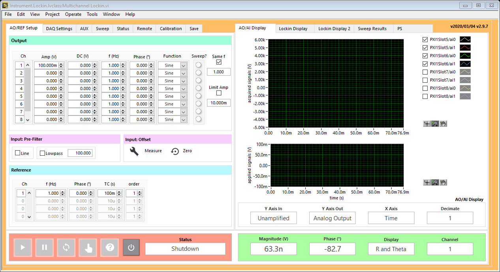
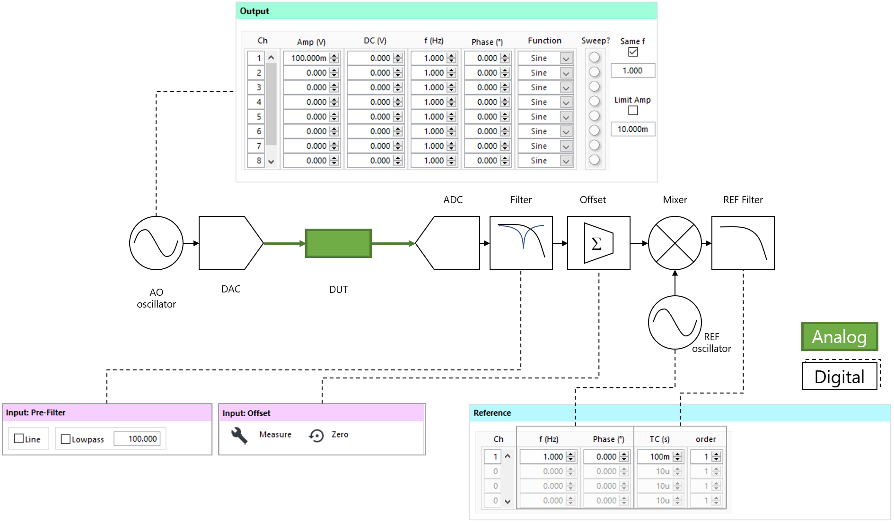
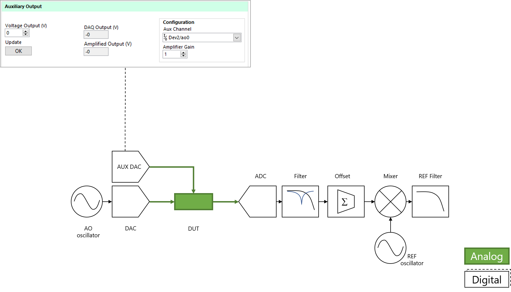
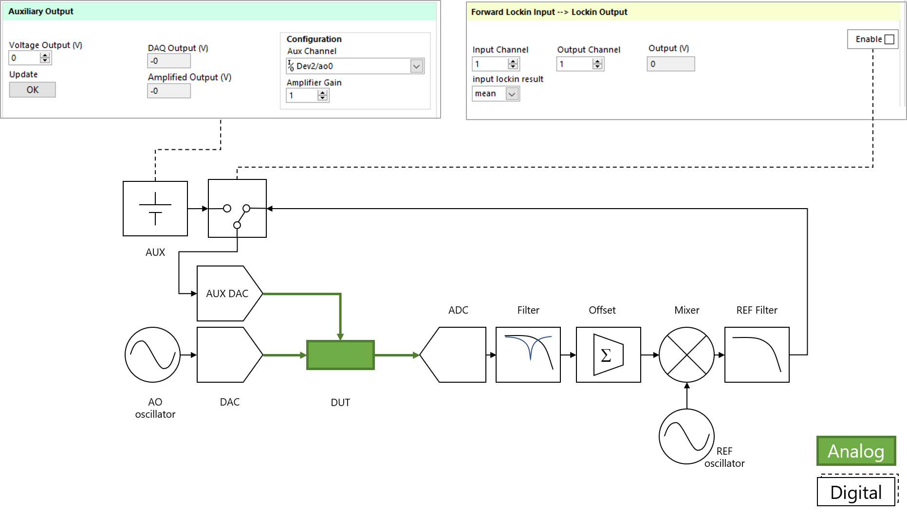
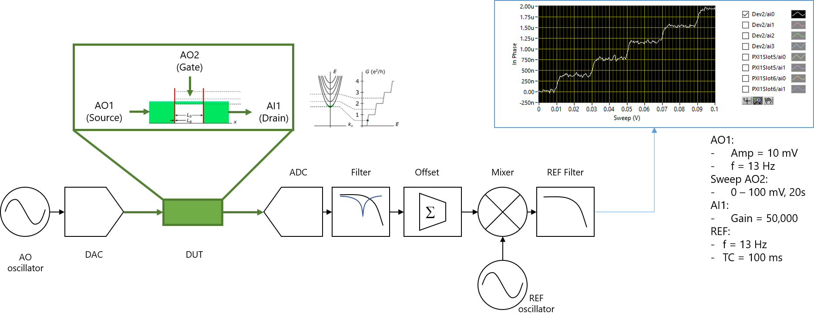

# Multichannel Lockin

Multichannel Lockin for National Instruments Dynamic Signal Acquisition hardware (4431, 4461, 4462). This version is configured to handle multiple cards for simultaneous, synchronized AI/AO. You can configure a number of analog outputs (8 or more) to output sine, square, sawtooth, or triangle functions with DC offsets. Each of the analog inputs (8 or more) can be demodulated at multiple frequencies.

## Installation
- LabVIEW 2016 32-bit required
- Multichannel Lockin.exe can be installed by downloading the latest installer found here [here](https://github.com/levylabpitt/Multichannel-Lockin/releases/latest)
- The LabVIEW API can be installed using VI Package Manager as described [here](https://levylabpitt.github.io/)

## Usage

## Contributing

Please contact [Patrick Irvin](p.irvin@levylab.org)

## License

[BSD-3](https://opensource.org/licenses/BSD-3-Clause)
