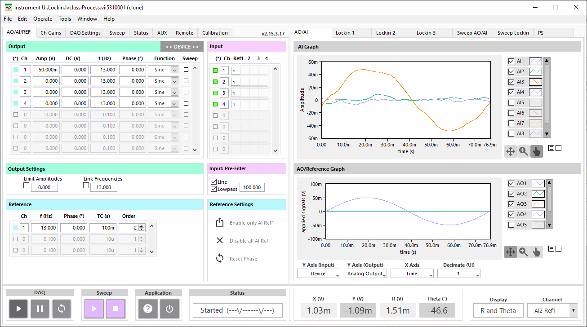
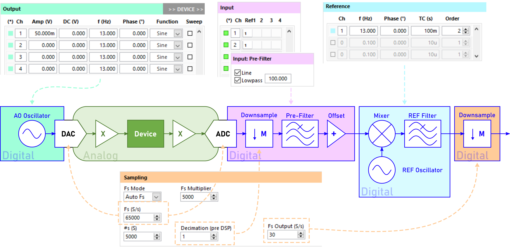
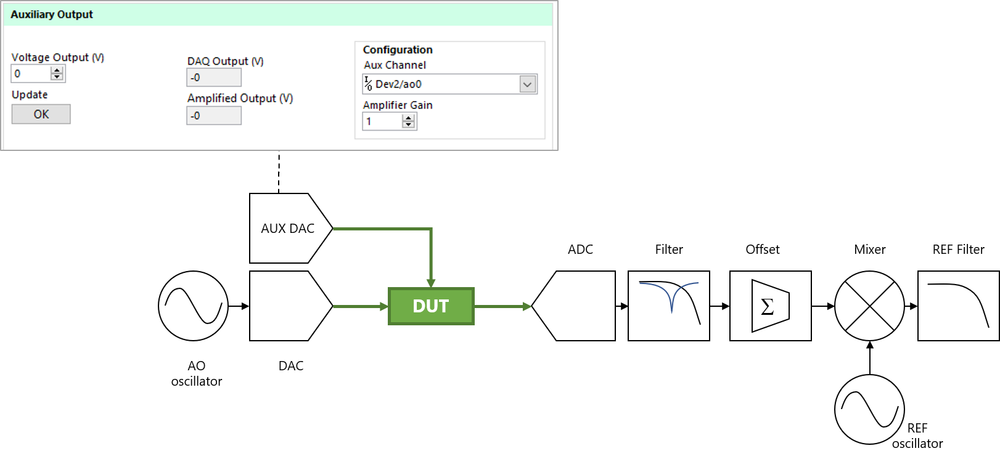
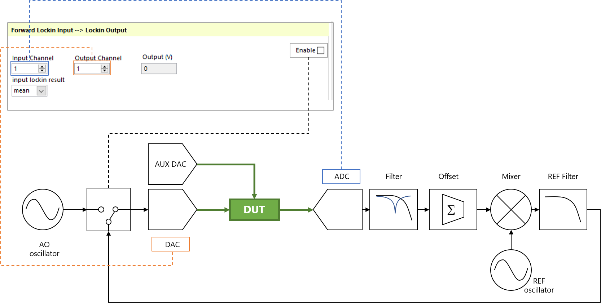
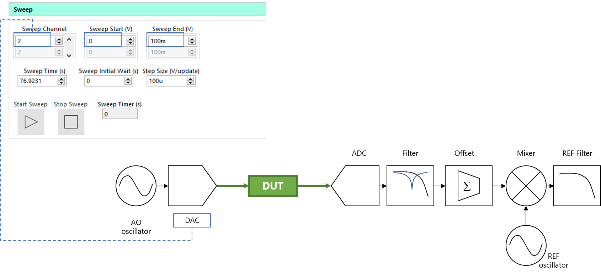
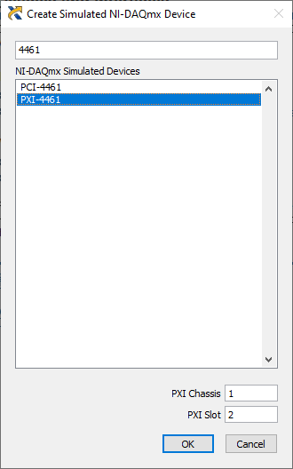

# Multichannel Lockin

Multichannel Lockin for National Instruments Dynamic Signal Acquisition hardware (4431, 4461, 4462). This version is configured to handle multiple cards for simultaneous, synchronized AI/AO. You can configure a number of analog outputs (8 or more) to output sine, square, sawtooth, or triangle functions with DC offsets. Each of the analog inputs (8 or more) can be demodulated at multiple frequencies.

## Installation
- LabVIEW 2019 32-bit required
- Multichannel Lockin.exe can be installed by downloading the latest installer found here [here](https://github.com/levylabpitt/Multichannel-Lockin/releases/latest)
- The LabVIEW API can be installed using VI Package Manager as described [here](https://levylabpitt.github.io/)

## Usage
### Basic Usage

The main controls are found on the "AO/REF Setup" tab:
- Analog outputs are configured in the "Output" section.
- Input prefilters and offsets are configured in the "Input" section.
- The lockin stage is configured in the "Reference" section.

The DSA DAQ settings (hardware addresses, input/output ranges, ac/dc coupling) are configured on the "DAQ Settings" section.

### Auxilliary Output

The lockin can be configured to output a static voltage on a multifunction DAQ in the "Auxilliary Output" section of the "AUX" tab. 

A demodulated lockin signal can also be routed to another analog output.

### Sweep Mode

- Sweep Mode will ramp a DC offset of **Sweep Channel** from the **Sweep Start** to **Sweep End** values in time givem by **Sweep Time**.
- Sweep Channel, Sweep Start, and Sweep End are all arrays.
- One can choose different starting and ending values (and directions) for each channel, but the Sweep Time is a global setting.
- The program will wait **Sweep Initial Wait** before beginning the sweep.
- **Step Size** will indicate how much the voltage changes per each refresh of the lockin for the first sweep channel. This value is determined by (Sweep Start - Sweep End)/(Sweep Time/Lock Refresh Time). You can also change this value and the Sweep Time will be calculated

### Power Spectrum

**(TO DO)**

## Simulation Mode

If the lockin is configured to use simulated DAQ hardware, the lockin operates in "simulation mode".

Simulated hardware can be configured in [NI MAX](http://www.ni.com/tutorial/3698/en/). 

### AI Simulation

In simulation mode the analog inputs can be somulated in three different ways:

- Hardware: AI is simulated by NI MAX.
  - This mode can be used to check DAQ configuration like input range
- Noisy AI: Each AO is connected to a corresponding AI (AO1 --> AI1)
  - A small amount of noise (~10 mV) is applied to the signal. AI1 = AO1 + noise
  - This mode can be used to test the functionality of the lockin demodulation
- Waveguide: An electron waveguide [1](#references) [2](#references) is modeled 

#### Hardware Simulation

**(TODO)**

#### Noisy AI Simulation

**(TODO)**

#### Waveguide Simulation
The simulated device is a three terminal quantum wire with conductance that quanitized in units of e2/h as a function of an applied gate voltage.

- AO1 = source voltage
- AO2 = gate voltage
- AI1 = drain current

## Contributing

Please contact [Patrick Irvin](https://github.com/ciozi137)

## License

[BSD-3](https://opensource.org/licenses/BSD-3-Clause)

## References

1. https://science.sciencemag.org/content/367/6479/769
2. https://arxiv.org/abs/1909.05698
