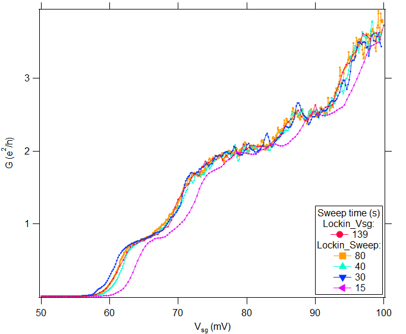
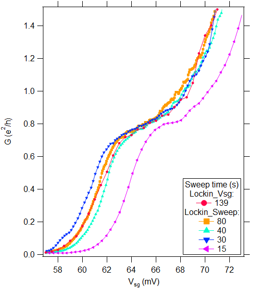
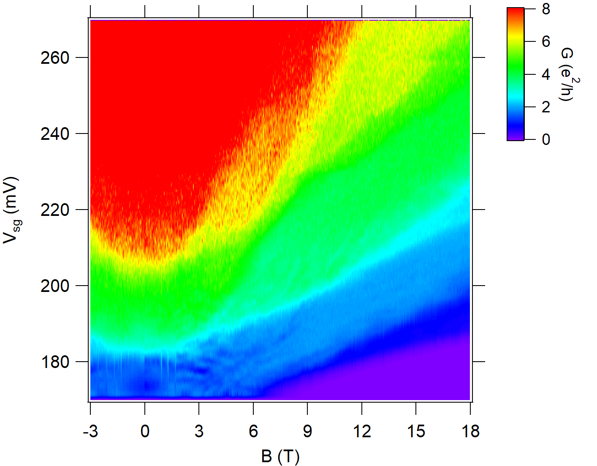
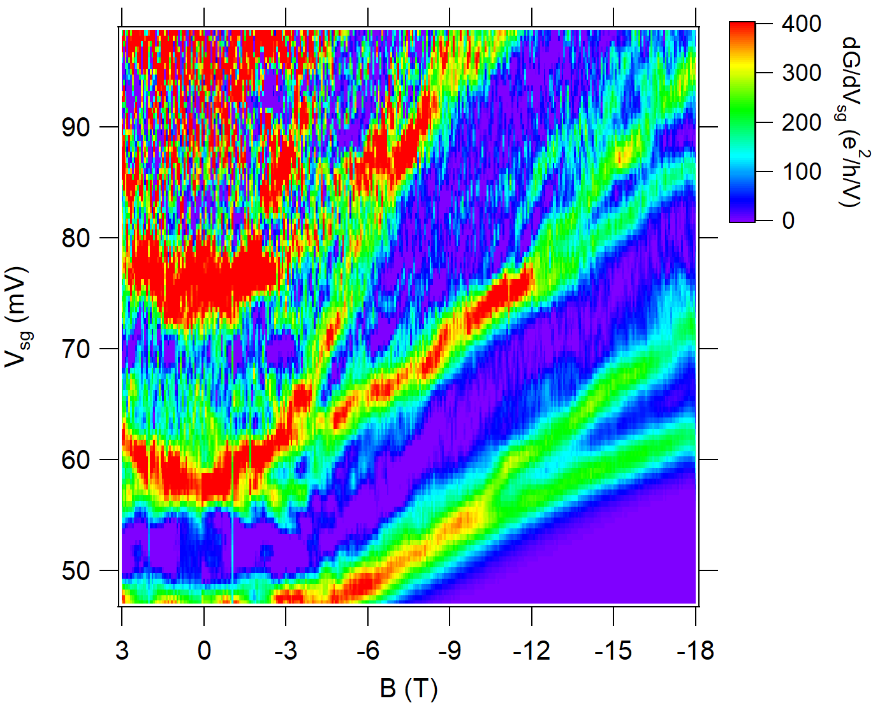
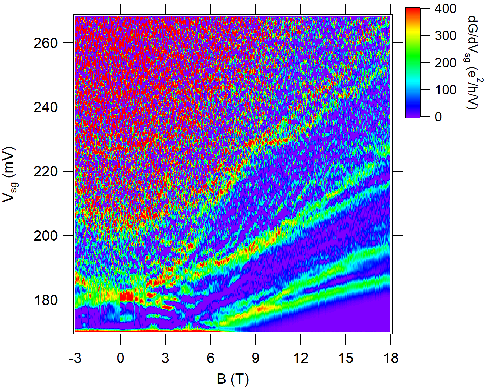
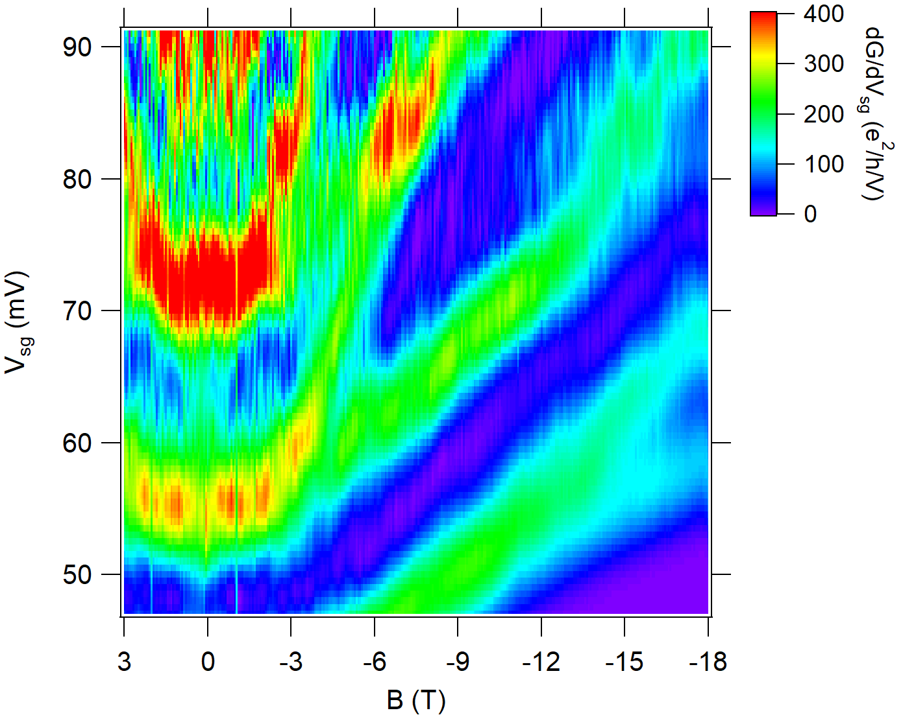
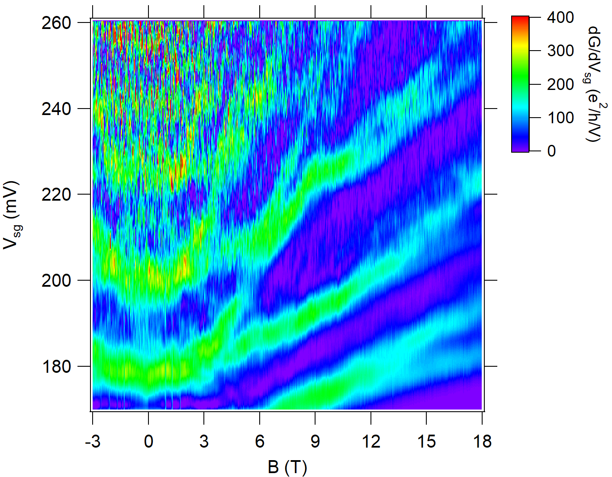

# Introduction
Lockin sweep mode is a new mode of the Multichannel Lockin that takes the form setSweep[[channel] [start] [end] delay time], where [channel] is an array of channels, [start] is an array of starting voltages, [end] is an array of ending voltages, delay is the amount of time to wait before starting to sweep, and time is the amount of time to sweep from start to end.

